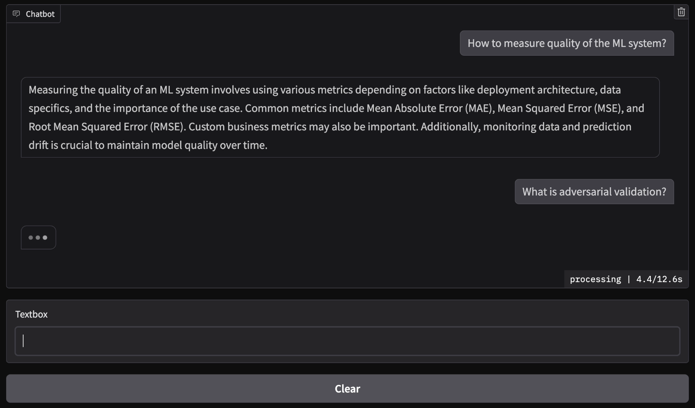

# ML System Design Interview Assistant

## Описание проекта
Интерактивный ассистент для подготовки к собеседованиям по ML System Design.


## Метрики качества
Валидационная выборка -- 50 вопросов-ответов, сгенерированных с помощью Sonnet 3.5 на случайном наборе глав исходных книг. Для каждого вопроса вручную размечен эталонный контекст. 

### Метрики ранжирования
| Метрика | Значение |
|---------|----------|
| Precision@1 | 0.64 |
| Precision@3 | 0.76 |
| Precision@5 | 0.81 |

### Метрики генерации
| Метрика | Значение |
|---------|----------|
| ROUGE-1 | 0.456 |
| BERTScore | 0.876 |
| expert | 44/50 |

## Основные возможности
- Загрузка и обработка PDF документов с материалами по ML System Design
- Создание векторного хранилища на основе документов с использованием FAISS
- Интерактивный чат-интерфейс на базе Gradio
- Генерация ответов с использованием GigaChat и RAG

## Технологический стек
- Python 3.9+
- LangChain для работы с LLM и RAG
- GigaChat в качестве языковой модели
- FAISS для векторного хранилища
- Sentence Transformers для эмбеддингов (all-mpnet-base-v2)
- Gradio для веб-интерфейса

## Как запустить?

### Локальный запуск

1. Установите зависимости:
```bash
pip install -r requirements.txt
```

2. Создайте файл .env в корневой директории проекта со следующими переменными:
```markdown
GIGACHAT_API_KEY=your_api_key_here
```

3. Запустите приложение:
```bash
python -m src.main
```

### Docker запуск

1. Соберите Docker образ:
```bash
docker build -t ml-system-design-assistant .
```

2. Запустите контейнер:
```bash
docker run -p 7860:7860 ml-system-design-assistant
```

### Доступ к приложению

После запуска приложение будет доступно по адресу: [http://localhost:7860](http://localhost:7860)

### Команда

- [Куляскин Михаил](https://github.com/Mihail-Olegovich)
- [Потехин Александр](https://github.com/alpotekhin)
- [Кандрюков Михаил](https://github.com/kandrewkov)
